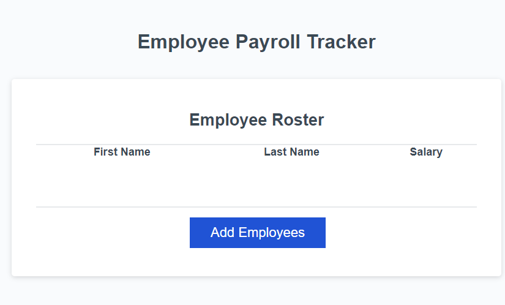

<b>Payroll Tracker</b> 

This project challenge was to adjust the starting code of HTML and CSS and implement the script file with JavaScript to function properly. The payroll tracker is supposed to prompt for adding employees and then to input them into a table. Once completed, inside the console log should display the average salary and random employee winner.  

This challenge was tough and good experience on implementing the multiple functions of JavaScript. Debugging of the console was helpful and it was great to piece everything together.  

Webpage for the payroll tracker! 

https://tcarocci.github.io/payroll-tracker/

Below is a screenshot of what the payroll window should look like!  

 